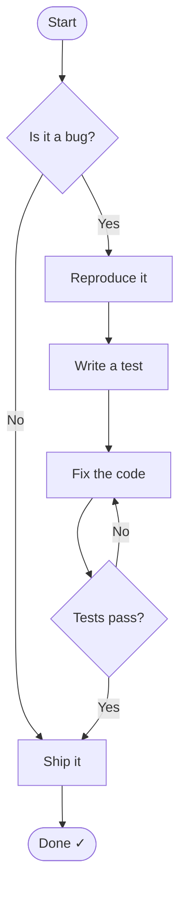
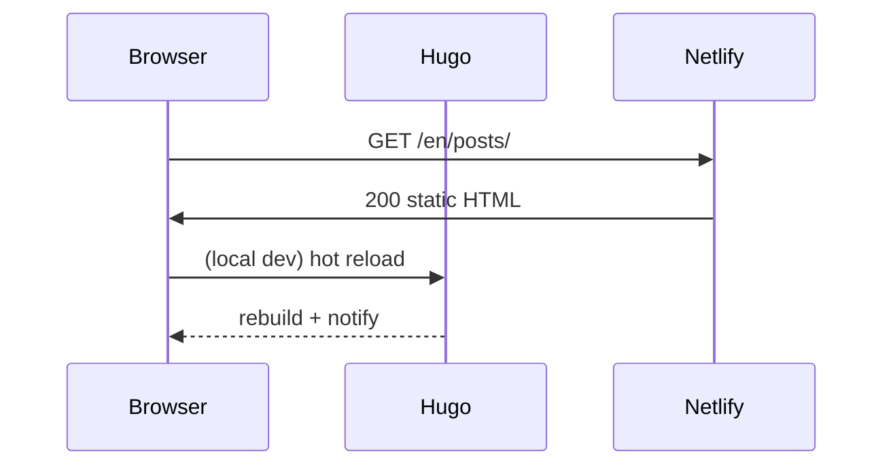

+++
title = "Hermit-V2 Feature Showcase"
date = "2026-04-12"
draft = true
description = "A personal cheatsheet demoing every interesting shortcode and theme feature."
tags = ["demo", "hermit-v2"]
toc = true
mathjax = true
scrolltotop = true
+++

This is a personal scratch post for testing every interesting feature in hermit-v2.
Nothing here is meant to be published.

---

## Admonitions

Eight built-in callout types. Markdown works inside all of them.


Default type. Good for side remarks and neutral context.



Custom titles work on all types. Markdown too — like **bold** and `inline code`.



Use `type=tip` for actionable suggestions. Works great in tutorials.



Confirming something worked, or a positive outcome.



Heads up — something worth paying attention to before proceeding.



What to do when something goes wrong.



For irreversible or destructive actions. Use sparingly.



A known issue or gotcha worth documenting.


### Collapsible Summary (new in latest sync)


This uses the HTML `<details>`/`<summary>` elements under the hood.
Perfect for spoilers, optional deep-dives, or long code snippets you don't
want to clutter the main flow.

```python
def hidden_treasure():
    return "you expanded it!"
```


---

## Syntax Highlighting

Code blocks with the copy button (enabled globally). Language is auto-detected from the fence tag.

```go
package main

import "fmt"

func fibonacci(n int) int {
    if n <= 1 {
        return n
    }
    return fibonacci(n-1) + fibonacci(n-2)
}

func main() {
    for i := range 10 {
        fmt.Printf("fib(%d) = %d\n", i, fibonacci(i))
    }
}
```

```bash
# Shell example — copy button works here too
git log --oneline --graph --all | head -20
```

```toml
# TOML config snippet
[params]
  homeSubtitle = "To be just a little less arrogant."
  scrollToTop  = true
  readTime     = true
```

---

## Mermaid Diagrams

Rendered natively — no setup needed beyond the fenced block.





---

## MathJax — LaTeX

Enabled per-post with `mathjax: true` in front matter.

Inline math: the identity $e^{i\pi} + 1 = 0$ is Euler's formula.

Block math:

$$
\int_{-\infty}^{\infty} e^{-x^2} \, dx = \sqrt{\pi}
$$

$$
\mathbf{F} = m\mathbf{a} \quad \Longrightarrow \quad \sum_i F_i = m \frac{d^2 x_i}{dt^2}
$$

---

## Figure Shortcode

Theme-extended `figure` with lazy loading support. Remote images work fine (no WebP conversion on remote URLs).



---

## Image Gallery

Requires `[params.gallery] enable = true` in `hugo.toml` (already added).


https://picsum.photos/seed/a1/600/400
https://picsum.photos/seed/b2/600/400
https://picsum.photos/seed/c3/600/400
https://picsum.photos/seed/d4/600/400
https://picsum.photos/seed/e5/600/400
https://picsum.photos/seed/f6/600/400


Click any image to open the lightbox. Arrow keys navigate, `Esc` closes.

---

## Custom `align` Shortcode

Project-specific shortcode for centering or right-aligning a paragraph.





---

## Emoji :tada:

`enableEmoji = true` in `hugo.toml` — just use GitHub-style shortcodes inline.

:rocket: :books: :brain: :coffee: :bug: :white_check_mark: :warning: :fire:

---

## Extended Markdown

`unsafe = true` is already set in markup config, so raw HTML works inside Markdown:

<kbd>Ctrl</kbd> + <kbd>S</kbd> to save. Use <mark>highlighted text</mark> with the HTML `<mark>` tag.

> A blockquote with the theme's accent-color left border.
> 
> Multi-paragraph quotes work too — just leave a blank line with `>`.

---

## Table of Contents

Rendered automatically from `toc = true` in front matter. Check the top of this page — hermit-v2 adds a floating TOC button in the header on desktop.

---

## Scroll to Top

Enabled with `scrolltotop = true` in front matter (and `scrollToTop = true` globally). Scroll to the bottom of this long post to see the floating button appear.
